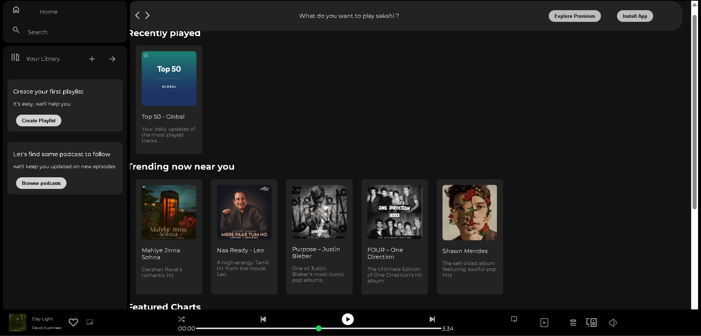

# Spotify Clone 🎵

A responsive **Spotify Web UI Clone** built using **HTML, CSS, and Bootstrap**.  
This project recreates the look and feel of Spotify’s web player with a modern dark-themed interface.

---

## 🚀 Live Demo
🔗 https://your-username.github.io/spotify-clone/

---

## 🖼️ Demo Preview

---

## ✨ Features
- Spotify-inspired dark UI
- Left sidebar navigation (Home, Search, Your Library)
- Sticky top navigation bar
- Playlist & album cards
- Recently played & trending sections
- Music player UI layout at the bottom
- Fully responsive design using Bootstrap

---

## 🛠️ Technologies Used
- **HTML5**
- **CSS3**
- **Bootstrap 5**
- **Bootstrap Icons**

---
